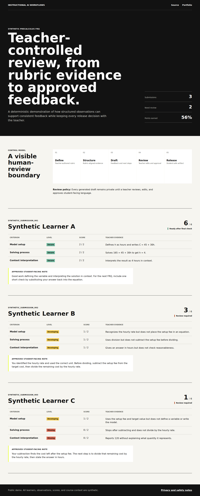

# Instructional AI Workflows

[](https://github.com/grant-mccurdy/instructional-ai-workflows/actions/workflows/quality.yml)

LMS-agnostic instructional workflow prototypes for teacher-controlled grading, feedback, review, and remediation artifacts.

**[Open the reviewer demo](https://grant-mccurdy.github.io/instructional-ai-workflows/)** | **[View the portfolio](https://grant-mccurdy.github.io/)**



This repository is intended to demonstrate controlled AI-assisted instructional workflows. It should not be framed as automatic test grading. The public framing is:

```text
teacher-defined rubric
-> structured evaluation
-> draft feedback
-> human review
-> student-facing feedback/review/remediation artifact
```

## What This Project Demonstrates

- Automated workflow support for test and assignment review
- Rubric-defined structured evaluation
- Draft feedback artifact generation
- Review artifact generation
- Remediation artifact generation
- Human-in-the-loop grading and feedback
- LMS adapter architecture
- Static HTML, Markdown, and PDF output options

## Current Demo

The first public-safe demo is a synthetic Precalculus free-response workflow:

```bash
make demo
```

The demo reads a teacher-defined rubric and synthetic rubric-aligned
observations, then writes:

- `sample_outputs/precalculus_frq/structured-evaluations.json`
- `sample_outputs/precalculus_frq/reviewer-packet.md`
- `sample_outputs/precalculus_frq/student-feedback.md`
- `sample_outputs/precalculus_frq/remediation-plan.md`

The workflow is deterministic and standard-library only. It does not claim to
grade raw student work automatically; teacher observations and human review
remain the control points.

## Reviewer Path

1. Open the live demo and inspect the review status, criterion evidence, and approved note for each synthetic learner.
2. Read [`core/workflow.py`](core/workflow.py) for the deterministic evaluation and remediation logic.
3. Run `make check` to regenerate outputs, validate the release boundary, render the static demo, and exercise desktop/mobile views.

The public demo uses pre-authored teacher observations, not raw student work or model-generated grades. Its main design claim is workflow control: private evidence remains separate from the reviewed student-facing artifact.

## Repository Structure

```text
instructional-ai-workflows/
├── core/                         # deterministic workflow logic
├── demos/precalculus_frq/        # synthetic rubric and observations
├── sample_outputs/precalculus_frq/
│   ├── structured-evaluations.json
│   ├── reviewer-packet.md
│   ├── student-feedback.md
│   └── remediation-plan.md
├── docs/
│   ├── workflow-overview.md
│   ├── human-in-the-loop.md
│   └── privacy-and-safety.md
├── pages/                        # static demo styling
└── scripts/                      # validation, rendering, visual smoke test
```

## Public Safety Rules

Public demos must use synthetic submissions, synthetic rubrics, fake course identifiers, and public-safe sample outputs.

Do not publish real student submissions, feedback, grades, comments, Canvas user IDs, assignment IDs, course IDs, API tokens, private screenshots, or teacher-only review artifacts.

## Portfolio Framing

Canvas should be presented as one adapter, not the product. The core value is the instructional workflow design: a teacher-defined, auditable process that supports consistent feedback and targeted remediation while keeping final judgment with the teacher.

## Status

Active public-safe prototype. The Precalculus FRQ demo covers the complete
rubric-to-feedback path with synthetic submissions, structured evaluation,
teacher review, student-facing feedback, and remediation planning outputs.

## Licensing

- Code is available under the [MIT License](LICENSE).
- Original documentation and generated visual content are available under [CC BY 4.0](LICENSE-CONTENT.md).
- Original synthetic datasets are available under [CC BY 4.0](LICENSE-DATA.md).

Third-party materials, trademarks, personal likenesses, and any acquired source material are excluded unless explicitly stated otherwise.
